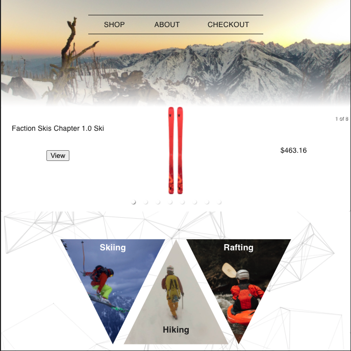
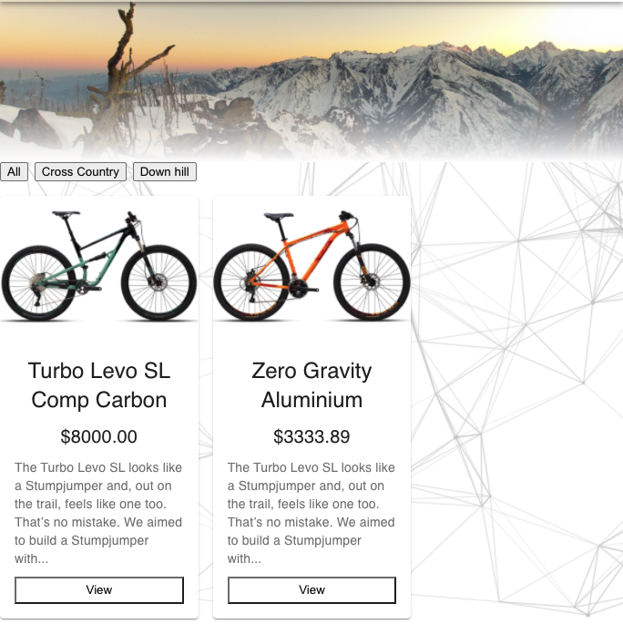
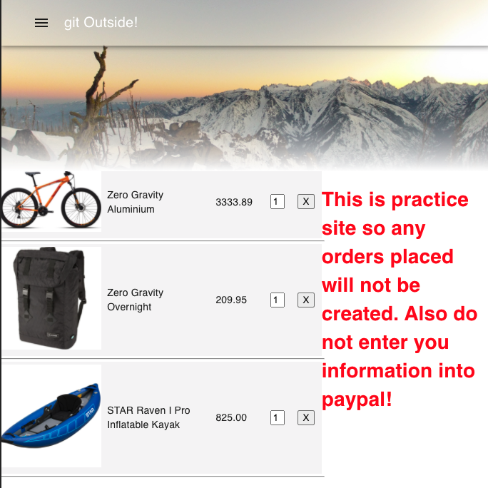

  # git Outside!

  Deployed Link: https://bjh-hop-estore.herokuapp.com/

  

  

  

  

  ## Description

  A practice E-store site with nice design. As far as E-stores go its simple but I enjoyed trying to make it look nice. It is Mobile responsive.

  ## Images

  
  ## Table of Content

  * [Installation](#installation)

  * [Usage](#usage)

  * [License](#license)

  * [Contributing](#contributors)

  * [Contact](#questions/contact)

 

  ## Usage

      This site is demonstrated from the customers perspective. As such, a customer would interact with this site like any other site.
  
  ## Technologies

      ReactJS with material-UI as framework, CSS, MySql, and Axios.

  ## Contributors

  Ben Hopkins

  ## Questions/Contact

  <a href="https://github.com/bh007183">GitHub Profile</a>
  <a href="mailto:bjhops17@gmail.com"> Email Me</a>
  
  

  
